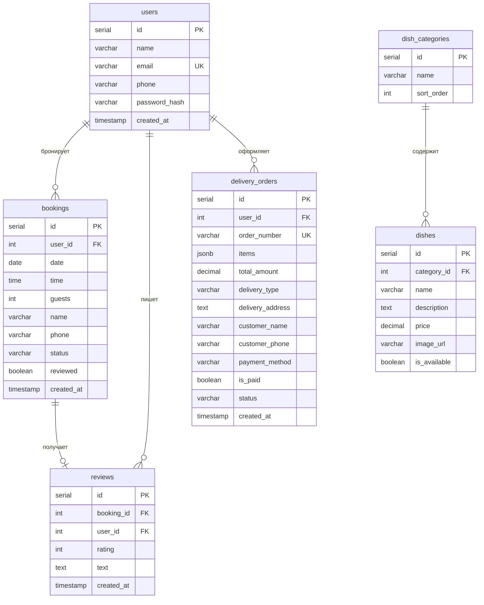

# Структура базы данных (ресторан «Прованс»)

```mermaid
erDiagram
    users ||--o{ bookings : "бронирует"
    users ||--o{ reviews : "пишет"
    users ||--o{ delivery_orders : "оформляет"
    bookings ||--o| reviews : "получает"
    dish_categories ||--o{ dishes : "содержит"

    users {
        serial id PK
        varchar name
        varchar email UK
        varchar phone
        varchar password_hash
        timestamp created_at
    }

    bookings {
        serial id PK
        int user_id FK
        date date
        time time
        int guests
        varchar name
        varchar phone
        varchar status
        boolean reviewed
        timestamp created_at
    }

    reviews {
        serial id PK
        int booking_id FK
        int user_id FK
        int rating
        text text
        timestamp created_at
    }

    dish_categories {
        serial id PK
        varchar name
        int sort_order
    }

    dishes {
        serial id PK
        int category_id FK
        varchar name
        text description
        decimal price
        varchar image_url
        boolean is_available
    }

    delivery_orders {
        serial id PK
        int user_id FK
        varchar order_number UK
        jsonb items
        decimal total_amount
        varchar delivery_type
        text delivery_address
        varchar customer_name
        varchar customer_phone
        varchar payment_method
        boolean is_paid
        varchar status
        timestamp created_at
    }
```

Исходная схема: `server/schema.sql`
